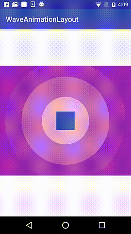
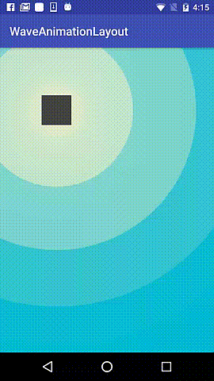
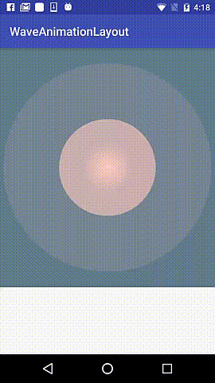

# WaveAnimationLayout



## Download
Add it in your root build.gradle at the end of repositories:
```groovy
allprojects {
  repositories {
    ...
    maven { url 'https://jitpack.io' }
  }
}
```
Add the dependency to your app.gradle:
```groovy
dependencies {
  ...
  compile 'com.github.jeketos:WaveAnimationLayout:1.0'
}
```
## Using
Add to your layout xml file WaveAnimateRelativeLayout
```xml
<com.jeketos.waveanimationlayout.WaveAnimateRelativeLayout
        android:id="@+id/animateLayout"
        android:layout_width="match_parent"
        android:layout_height="match_parent"
        app:animDuration="5000"
        app:wavesCount="10"
        app:relativeTo="@+id/view"
        app:startColor="@color/colorPrimary"
        >
```
For auto start animation add to your Activity or Fragment next:
```kotlin
override fun onResume() {
    super.onResume()
    animateLayout.startAnim()
}

override fun onPause() {
    super.onPause()
    animateLayout.stopAnim()
}
```
Also you can use startAnim()/stopAnim() in any time by yourself.

## XML Atributes
* `animDuration` - one wave animation duration
* `wavesCount` - waves count for animDuration 
* `startX` - position X point related to wave animation container
* `startY` - position Y point related to wave animation container
* `relativeTo` - position related to the center of view in wave animation container. When used - startX, StartY is ignored
* `startSize` - start size of animated wave
* `startColor` - start color of animated view

If nothing of `startX, startY, relativeTo` not specified waves related to center of wave animation container.
